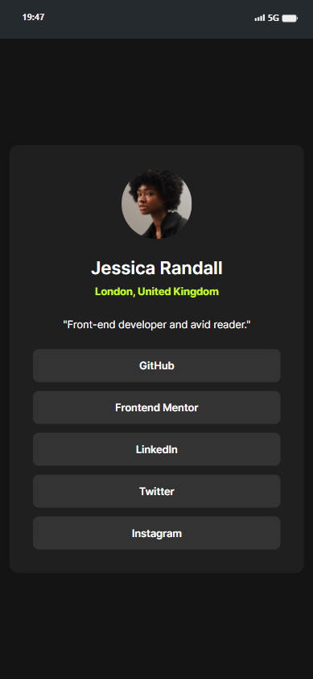
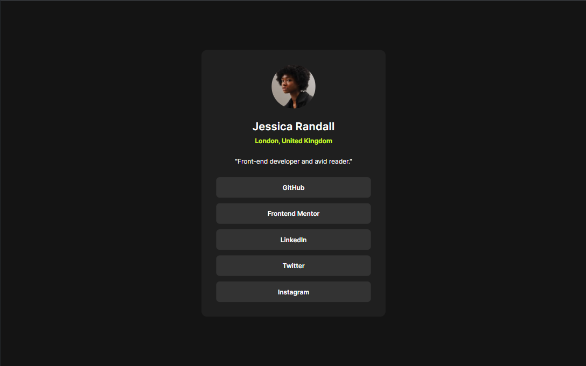
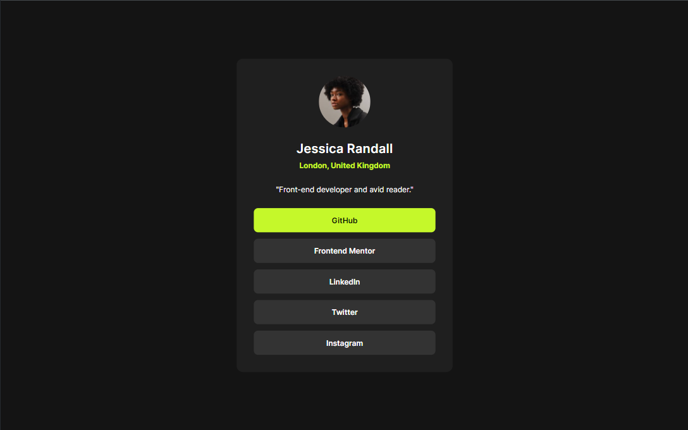

# Frontend Mentor - Social Links Profile

This project is a solution to the Social links profile challenge on Frontend Mentor. Frontend Mentor challenges are a great way to enhance your coding skills by building realistic projects.

## Overview

### The Challenge

The challenge required implementing hover and focus states for all interactive elements on the page.

### Screenshot

### Mobile

### Links

- Live Site URL: [Here](https://raphaelelias-sociallinksprofile.netlify.com)

## My Process
### Built With
- HTML
- Tailwind CSS

### What I Learned

During this project, I reinforced my understanding of:

- Using Tailwind CSS for styling
- Implementing basic HTML structure
- Continued Development

### In future projects, I aim to:

- Explore more advanced Tailwind CSS features
- Dive deeper into HTML and CSS techniques

### Useful Resources
- [Tailwind CSS Documentation](https://tailwindcss.com/docs) - Helpful for understanding Tailwind CSS classes and features.

## Author
- GitHub - [@raphaeleliass](https://www.github.com/raphaeleliass)

## Acknowledgments

- Challenge by [Frontend Mentor](https://www.frontendmentor.io?ref=challenge).

- Coded by [Raphael Elias](https://www.github.com/raphaeleliass).